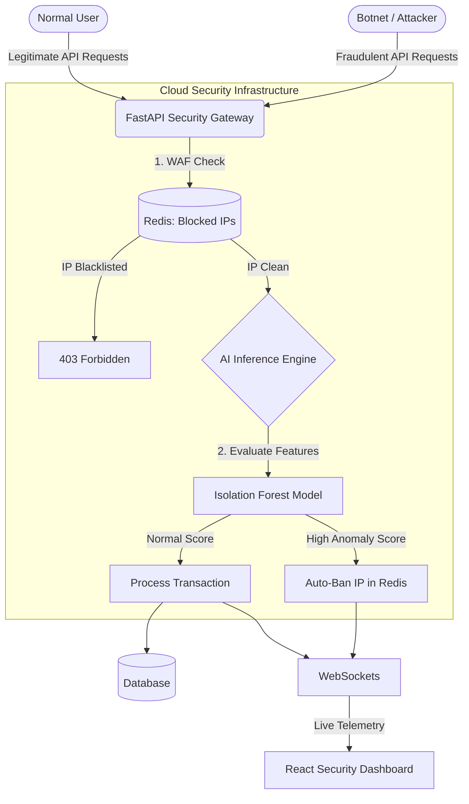

# AI-Driven Cloud Security & Fraud Detection Engine 🛡️🤖


A High-Concurrency **Cloud Security Gateway** that uses **Machine Learning (Isolation Forests)** to instantly detect and block credential stuffing, API abuse, and fraudulent transactions in real-time.

## 🌟 The Problem it Solves
Standard API Gateways rely on hard-coded rate limits (e.g., "block if > 100 requests per minute"). However, modern botnets and attackers use distributed VPNs to stay just below these rate limits. 
This architecture solves this by injecting an **AI Inference Layer** directly into the API pipeline. The Machine Learning model evaluates geographical distance, device trust, and request velocity simultaneously, assigning a Live Fraud Score to every request and auto-blacklisting malicious IPs at the WAF level.

## 🏗️ Architecture Diagram



## 🚀 Features
* **Machine Learning Anomaly Detection:** Trained an `IsolationForest` model to detect multivariate outliers in API traffic.
* **Live WAF Simulation:** Redis-backed state management for O(1) IP blocking and rolling-window rate limiting.
* **Real-Time WebSockets Dashboard:** A stunning React frontend that visualizes the AI blocking attacks in milliseconds.
* **Dockerized & Terraform Ready:** Full DevSecOps CI/CD compliance.

## 🛠️ Tech Stack
* **Framework:** FastAPI, Uvicorn
* **AI/ML:** Scikit-Learn, Numpy, Pickle
* **Security:** Redis (State Management), WebSockets
* **DevSecOps:** Docker Compose, Terraform

## 🚀 Quick Start (Local Demo)

### 1. Start the Distributed Engine (Docker)
```bash
docker-compose up --build
```

### 2. Simulate the Cyber Attack
In a separate terminal, launch the high-speed attack simulator:
```bash
python simulate_attacks.py
```

### 3. View the AI in Action
Open `http://localhost:5174` in your browser. 
You will see the React Dashboard streaming normal traffic, and suddenly flashing red as the AI detects the botnet and instantly blacklists the attacker IPs!

---
*Built as a masterclass demonstration of AI-driven Cloud Security Architecture.*
